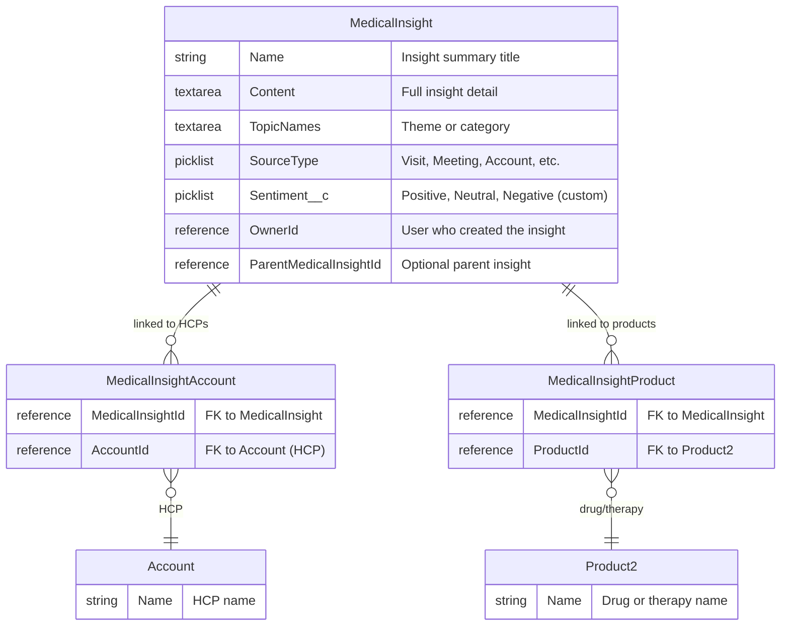
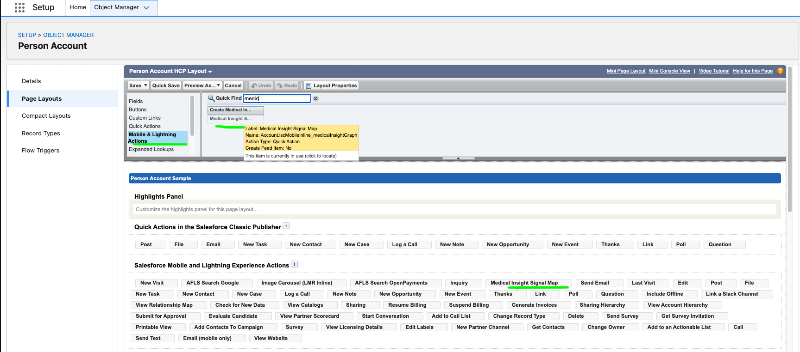

# Medical Insight Signal Map for Agentforce Life Sciences Cloud

An interactive Lightning Web Component built for the **AFLS iPad app** that transforms Medical Insight records into a visual network, powered by **Agentforce** for AI-driven analysis. Designed for field reps who need to quickly understand HCP sentiment patterns and discover hidden connections between physicians — while on the go, with an internet connection.


## Why This Matters

Life Sciences field reps capture dozens of medical insights across HCP interactions — meeting notes, sentiment signals, topic interests, competitive intelligence. Today, that data lives in **related lists and record pages** that make it nearly impossible to:

- See which HCPs share concerns about the same topic
- Spot emerging sentiment trends across a territory
- Compare two physicians' perspectives side-by-side
- Identify the right moment to connect a skeptical HCP with a champion

The Signal Map solves this by rendering insights as a **force-directed graph** where HCPs, topics, and products become interactive nodes. When two HCPs share a topic, the graph draws a visible link between them — making patterns obvious that would take minutes of clicking through records to discover.

Then, with one tap on **Ask Agentforce**, the rep gets an AI-generated comparison of both HCPs' positions, similarities, differences, and a recommended next step — all without leaving the graph.

## Features

- **D3.js Force-Directed Graph** — HCPs, topics, and products rendered as physics-based nodes that cluster naturally by relatedness. Tap and drag to explore. Pinch to zoom. The layout adapts organically as you filter.
- **Sentiment Color Coding** — Nodes glow green (Positive), gray (Neutral), or red (Negative) so territory-wide sentiment is visible at a glance.
- **Shared Theme Detection** — When multiple HCPs have insights on the same topic, the graph links them visually. Tap any link to see the specific insights from both HCPs side-by-side.
- **Agentforce AI Analysis** — Select a single HCP to get a summary of their insights and recommended actions. Select a link between two HCPs to get an AI-powered comparison of their positions, with concrete next steps.
- **Sentiment Filtering** — Toggle Positive, Neutral, or Negative to isolate specific sentiment patterns across the network.
- **Mobile-First for iPad** — Built as an inline LWC that works within the AFLS iPad app with an internet connection.

## Data Model

This project uses the **standard Life Sciences Cloud data model** (260+). The only custom addition is a `Sentiment__c` picklist field on `MedicalInsight`.



## Prerequisites

- Salesforce CLI installed (`sf --version`)
- Einstein Generative AI enabled (for Agentforce features)
- The `MedicalInsight` standard object must be available (included in AFLSC4CE)

## Deployment

### 1. Authenticate to your org

```bash
sf org login web --alias my-org
```

### 2. Deploy the custom `Sentiment__c` field

The standard `MedicalInsight` object does not include a sentiment field. This project adds one custom picklist:

| Field | API Name | Object | Type | Values |
|---|---|---|---|---|
| Sentiment | `Sentiment__c` | `MedicalInsight` | Picklist (Restricted) | `Positive`, `Neutral`, `Negative` |

```bash
sf project deploy start \
  --source-dir force-app/main/default/objects/MedicalInsight \
  --target-org my-org
```

### 3. Deploy the Field Sales Representative profile

```bash
sf project deploy start \
  --source-dir force-app/main/default/profiles \
  --target-org my-org
```

This grants the `Field Sales Representative` profile access to `LSC_Demo_MedicalInsightController`, which is required for field reps to use the graph and Agentforce features.

### 4. Create and assign a Permission Set

In addition to the profile, create a permission set that grants:
- Read/Edit access to `MedicalInsight.Sentiment__c` (Field-Level Security)
- Access to the `LSC_Demo_MedicalInsightController` Apex class
- The `Einstein Generative AI` system permission (for Agentforce)

Assign the permission set to all users who will use the Signal Map (admins and field reps).

### 5. Deploy the LWC and Apex controller

```bash
sf project deploy start \
  --source-dir force-app/main/default/lwc/lscMobileInline_medicalInsightGraph \
  --target-org my-org
```

### 6. Add the Quick Action to the Person Account page layout

The LWC is exposed as a Quick Action that must be added to the **Person Account** page layout (not the standard Account layout) so it renders in the AFLS iPad app.

1. Go to **Setup > Object Manager > Person Account > Page Layouts**
2. Open the Person Account page layout
3. In the **Salesforce Mobile and Lightning Experience Actions** section, add the `Medical Insight Signal Map` quick action
4. Save the layout



> **Important:** The quick action must be on the **Person Account** layout specifically. This is what tells the mobile app to render the component for HCP records. See [Salesforce Help: Create and Add LWC Quick Action to Record Page](https://help.salesforce.com/s/articleView?id=ind.lsc_customer_engagement_create_and_add_lwc_quick_action_to_record_page.htm&type=5) for more details.

### 7. Load sample data

The Apex script creates 22 insights across 5 HCPs with shared-theme connections and links them to the Immunexis product:

```bash
sf apex run \
  --file scripts/apex/load_medical_insights_standard.apex \
  --target-org my-org
```

> **Note:** The script contains hardcoded Account IDs and Product IDs for the 260-test org. Before running against a different org, update the HCP Account IDs and `immunexisId` values to match your org's records.

### 8. Share records (if OWD is Private)

If your org's OWD for `MedicalInsight` or `Account` is Private, share records with field reps:

```bash
sf apex run \
  --file scripts/apex/share_records_with_user.apex \
  --target-org my-org
```

> Edit the `userId` variable in the script to target the appropriate user.

### 9. Verify the data

```bash
sf data query \
  --query "SELECT Id, Name, Sentiment__c, TopicNames, SourceType, \
           (SELECT Account.Name FROM MedicalInsightAccounts), \
           (SELECT Product.Name FROM MedicalInsightProducts) \
           FROM MedicalInsight \
           WHERE Sentiment__c != null \
           ORDER BY Name" \
  --target-org my-org
```

### 10. Add the component to a Lightning page

- **App Builder** > open an Account record page (recommended) or a custom Lightning page
- Drag `lscMobileInline_medicalInsightGraph` onto the canvas
- On an Account record page, `recordId` is passed automatically and the graph focuses on that HCP; otherwise it renders the full network
- Save and Activate

## Demo Data

The data load script creates insights across 5 HCPs in 8 therapeutic topics:

| HCP | Insights |
|---|---|
| HCP 1 | Efficacy in Refractory RA, Early Intervention Potential, Comparative Data, Quality of Life, Multi-Indication Interest |
| HCP 2 | Comparative Data, Real-World Evidence, Efficacy in Refractory RA, Immunogenicity |
| HCP 3 | Mechanism Doubts, Immunogenicity, Real-World Evidence, Comparative Data |
| HCP 4 | Quality of Life, Efficacy in Refractory RA, Early Intervention Potential, Multi-Indication Interest |
| HCP 5 | Multi-Indication Interest, Real-World Evidence, Early Intervention Potential, Quality of Life, Mechanism Doubts |

All insights are linked to **Immunexis 10mg** via `MedicalInsightProduct`.

Sentiments: Positive, Neutral, and Negative distributed across HCPs to demonstrate filtering.

## Agentforce Integration

The **Ask Agentforce** button appears whenever a node or link is selected:

- **Single HCP selected** — Summarizes the HCP's medical insights, topics, and sentiment, then recommends next steps for the field rep.
- **Link between two HCPs selected** — Compares insights across both HCPs, summarizes similarities and differences, and recommends a concrete next action.

This is the key differentiator: instead of manually reading through two HCPs' related lists, comparing notes, and synthesizing a plan, the rep taps one button and gets an actionable comparison in seconds.

### Apex Method

`LSC_Demo_MedicalInsightController.askAgentforce(String contextJson)` accepts JSON context and calls `ConnectApi.EinsteinLLM.generateMessages()`.

## Useful Commands

```bash
# List connected orgs
sf org list

# Re-deploy the LWC after edits
sf project deploy start \
  --source-dir force-app/main/default/lwc/lscMobileInline_medicalInsightGraph \
  --target-org my-org

# Query insights with HCP names
sf data query \
  --query "SELECT MedicalInsight.Name, MedicalInsight.Sentiment__c, \
           MedicalInsight.TopicNames, Account.Name \
           FROM MedicalInsightAccount \
           ORDER BY Account.Name" \
  --target-org my-org
```

## Troubleshooting

- **`Sentiment__c` not found** — Deploy the custom field and assign the permission set (see Deployment steps 2-3)
- **No data in the graph** — Verify `MedicalInsight` records exist and `MedicalInsightAccount` junctions link them to Accounts
- **Wrong HCPs** — The data load script has hardcoded Account IDs for 260-test; update them for your org
- **SourceType errors** — Valid values: `Visit`, `Account`, `Meeting`, `HomePage`, `MedicalInsightsTab`
- **Agentforce not responding** — Ensure Einstein Generative AI is enabled and the user has the appropriate permission set

## Disclaimer

This project is provided **"AS IS"** without warranty of any kind, express or implied. It is intended as a **demonstration and reference implementation only**. Before deploying to any org:

- Thoroughly test all components in a sandbox or scratch org first
- Verify compatibility with your specific org configuration, edition, and Life Sciences Cloud version
- Review all hardcoded IDs in the data loading scripts and update them for your environment
- Validate that permission sets, field-level security, and sharing rules meet your organization's security requirements
- This project is not an official Salesforce product and is not supported by Salesforce Support

**You are solely responsible for testing, validating, and ensuring this code is appropriate for your org.**

## License

MIT License

Copyright (c) 2025-2026

Permission is hereby granted, free of charge, to any person obtaining a copy
of this software and associated documentation files (the "Software"), to deal
in the Software without restriction, including without limitation the rights
to use, copy, modify, merge, publish, distribute, sublicense, and/or sell
copies of the Software, and to permit persons to whom the Software is
furnished to do so, subject to the following conditions:

The above copyright notice and this permission notice shall be included in all
copies or substantial portions of the Software.

THE SOFTWARE IS PROVIDED "AS IS", WITHOUT WARRANTY OF ANY KIND, EXPRESS OR
IMPLIED, INCLUDING BUT NOT LIMITED TO THE WARRANTIES OF MERCHANTABILITY,
FITNESS FOR A PARTICULAR PURPOSE AND NONINFRINGEMENT. IN NO EVENT SHALL THE
AUTHORS OR COPYRIGHT HOLDERS BE LIABLE FOR ANY CLAIM, DAMAGES OR OTHER
LIABILITY, WHETHER IN AN ACTION OF CONTRACT, TORT OR OTHERWISE, ARISING FROM,
OUT OF OR IN CONNECTION WITH THE SOFTWARE OR THE USE OR OTHER DEALINGS IN THE
SOFTWARE.
