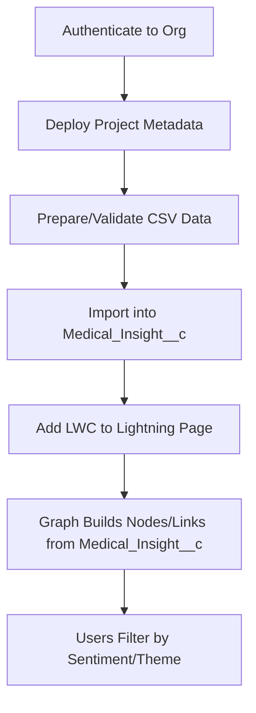

# LSC Medical Insight Graph

An interactive Lightning Web Component (LWC) that visualizes relationships between HCPs (Accounts) and medical insight themes using D3.js.

The graph reads data from the custom object `Medical_Insight__c` and builds a network of:
- HCP nodes (from `Account__c` on `Medical_Insight__c`)
- Theme nodes (from `Topic__c`)
- Links based on shared themes across HCPs

## Prerequisites (Required)
- Salesforce CLI installed (`sf --version`)
- Access to a Salesforce org
- The custom object `Medical_Insight__c` and fields must be deployed to the org
- Records must exist in `Medical_Insight__c` (at least a few) so the graph has something to render

### Notes about `Medical_Insight__c`
- The `Name` field is an AutoNumber (don’t include `Name` when importing)
- `Account__c` is the HCP reference (Master-Detail or Lookup depending on your org)
- `Source_Type__c` is a restricted picklist; valid values include: "1:1 Visit", "Congress", "Advisory Board", "Conference", "Phone Call", "Email", "Literature Review", "Other"
- Example fields used by the LWC: `Summary__c`, `Detail__c`, `Sentiment__c`, `Topic__c`, `Date__c`, `Therapeutic_Area__c`, `Source_Type__c`, `Account__c`

## Getting Started

1) Authenticate to an org (choose your alias):
```bash
sf org login web --alias my-org
```

2) Deploy metadata (object, fields, Apex, profile updates, LWC, static resources):
```bash
sf project deploy start --target-org my-org
```

3) Load sample data into `Medical_Insight__c` (pick one of the provided CSVs or your own):
```bash
# Example: curated data with valid picklist values
sf data import bulk \
  --file new_medical_insights_corrected.csv \
  --sobject Medical_Insight__c \
  --target-org my-org

# More examples in these locations
#   force-app/main/default/data/medical_insights_final.csv
#   additional_morita_safety_insights.csv
#   seeddata/medical_insights_demo.csv (clean/align picklists before importing)
```

4) Verify records:
```bash
sf data query \
  --query "SELECT Id, Name, Topic__c, Sentiment__c, Account__r.Name FROM Medical_Insight__c ORDER BY CreatedDate DESC LIMIT 20" \
  --target-org my-org
```

5) Add the component to a Lightning page:
- App Builder → open an Account record page (recommended) or a custom Lightning page
- Drag `lscMobileInline_medicalInsightGraph` onto the canvas
- If placed on an Account record page, `recordId` is passed automatically and the graph will focus on that HCP; otherwise it will render the overall network
- Save and Activate

## Data Requirements
To see meaningful results you should have a few dozen `Medical_Insight__c` records with a mix of:
- Multiple HCPs (different `Account__c` values)
- A variety of themes in `Topic__c`
- Sentiments in `Sentiment__c` (Positive, Neutral, Negative)

## Common Import Tips
- Don’t include `Name` (it's AutoNumber)
- Ensure `Source_Type__c` uses only allowed picklist values (see above)
- If you reference HCPs, confirm the `Account` Ids exist in the target org
- CSVs must be well-formed; quote any fields with commas or line-breaks

## How It Works (High-Level)



## Useful Commands

- List orgs:
```bash
sf org list
```

- Re-deploy the LWC after edits:
```bash
sf project deploy start --source-dir force-app/main/default/lwc/lscMobileInline_medicalInsightGraph --target-org my-org
```

- Import another dataset:
```bash
sf data import bulk --file path/to/your.csv --sobject Medical_Insight__c --target-org my-org
```

## Troubleshooting
- Invalid picklist value for `Source_Type__c`: align your CSV values with the field’s metadata list
- Error on `Name`: remove `Name` column (AutoNumber)
- Boolean vs text errors: ensure the CSV matches field types (e.g., `Follow_Up__c` should be text if your org uses TextArea)
- No data in the graph: verify `Medical_Insight__c` has records and the component is on an active Lightning page

## Component Notes
- Component: `lscMobileInline_medicalInsightGraph`
- Uses a Static Resource `d3`
- Positive filter highlights HCP nodes in green by default

---

If you need a turnkey dataset, use `new_medical_insights_corrected.csv` (valid picklists) and the graph will render immediately after import.
