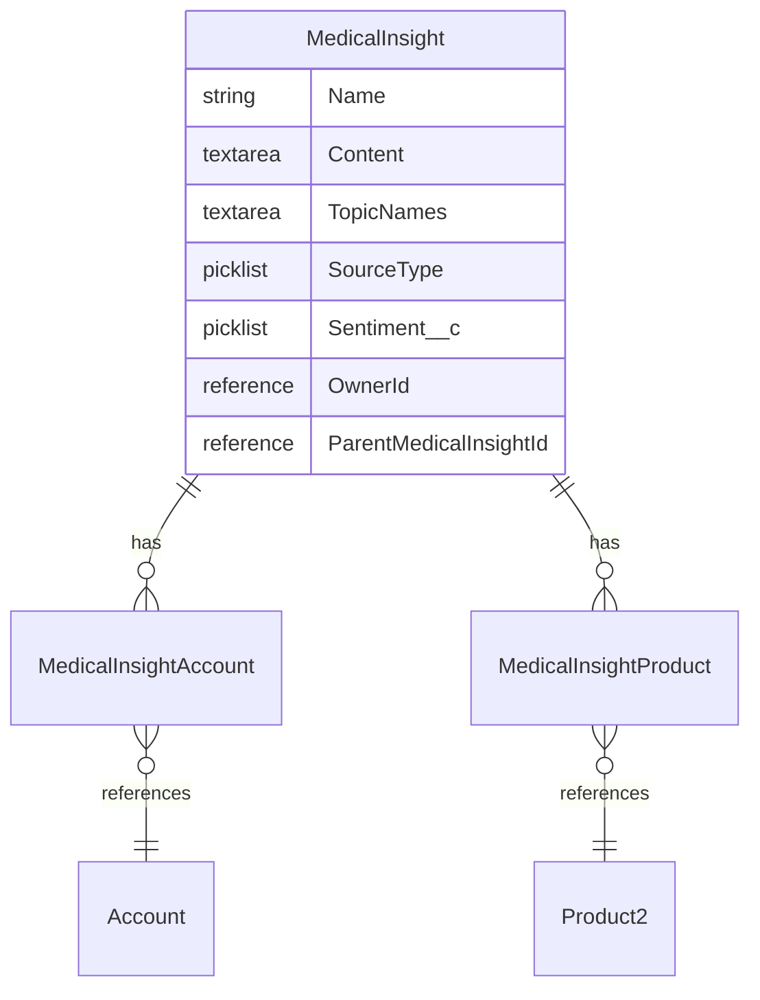
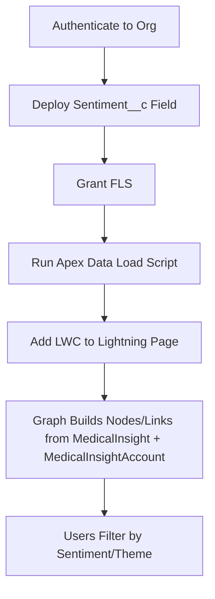

# LSC Medical Insight Graph

An interactive Lightning Web Component (LWC) that visualizes relationships between HCPs (Accounts) and medical insight themes using D3.js.

The graph reads data from the standard `MedicalInsight` object (Life Sciences Cloud 260+) and builds a network of:
- HCP nodes (from `MedicalInsightAccount` junction records)
- Theme nodes (from `TopicNames` on `MedicalInsight`)
- Links based on shared themes across HCPs

## Prerequisites (Required)
- Salesforce CLI installed (`sf --version`)
- Access to a Life Sciences Cloud org (260+)
- The standard `MedicalInsight` object must be available (included with LSC)
- Records must exist in `MedicalInsight` with associated `MedicalInsightAccount` junction records

### Custom Field: `Sentiment__c` on `MedicalInsight`

The standard `MedicalInsight` object does **not** include a sentiment field. This project requires one custom picklist field to be created:

| Field | API Name | Object | Type | Values |
|---|---|---|---|---|
| Sentiment | `Sentiment__c` | `MedicalInsight` | Picklist (Restricted) | `Positive`, `Neutral`, `Negative` |

**To deploy this field**, run:
```bash
sf project deploy start \
  --source-dir force-app/main/default/objects/MedicalInsight \
  --target-org <your-org-alias>
```

The field metadata is included in this project at:
`force-app/main/default/objects/MedicalInsight/fields/Sentiment__c.field-meta.xml`

After deploying, you must grant **Field-Level Security** (FLS) to the appropriate profiles/permission sets. You can do this via Setup > Object Manager > Medical Insight > Fields > Sentiment > Set Field-Level Security, or by running:
```apex
// Grant FLS to System Administrator profile
List<PermissionSet> ps = [SELECT Id FROM PermissionSet WHERE Profile.Name = 'System Administrator' LIMIT 1];
if (!ps.isEmpty()) {
    insert new FieldPermissions(
        ParentId = ps[0].Id,
        SobjectType = 'MedicalInsight',
        Field = 'MedicalInsight.Sentiment__c',
        PermissionsRead = true,
        PermissionsEdit = true
    );
}
```

### Standard Fields Used

These fields are part of the standard `MedicalInsight` object — no custom fields needed:

| Field | API Name | Purpose |
|---|---|---|
| Name | `Name` | Insight summary/title |
| Content | `Content` | Full insight detail text |
| Topic Names | `TopicNames` | Theme/category for the insight |
| Source Type | `SourceType` | How the insight was captured (Visit, Meeting, Account, etc.) |
| Owner | `OwnerId` | User who created the insight |

### Related Objects Used

| Object | Relationship | Purpose |
|---|---|---|
| `MedicalInsightAccount` | Junction (M:N) | Links insights to HCP accounts — supports multi-HCP insights |
| `MedicalInsightProduct` | Junction (M:N) | Links insights to products (e.g., Immunexis) |

## Getting Started

1) Authenticate to an org (choose your alias):
```bash
sf org login web --alias my-org
```

2) Deploy the custom `Sentiment__c` field:
```bash
sf project deploy start \
  --source-dir force-app/main/default/objects/MedicalInsight \
  --target-org my-org
```

3) Grant FLS for `Sentiment__c` (see Custom Field section above)

4) Load sample data using the Apex script:
```bash
sf apex run \
  --file scripts/apex/load_medical_insights_standard.apex \
  --target-org my-org
```

> **Note:** The data loading script (`scripts/apex/load_medical_insights_standard.apex`) contains hardcoded Account IDs and Product IDs for the 260-test org. Before running against a different org, update the `hcpMap` and `immunexisId` values to match your org's records.

5) Verify records:
```bash
sf data query \
  --query "SELECT Id, Name, Sentiment__c, TopicNames, SourceType, \
           (SELECT Account.Name FROM MedicalInsightAccounts), \
           (SELECT Product.Name FROM MedicalInsightProducts) \
           FROM MedicalInsight \
           WHERE Sentiment__c != null \
           ORDER BY Name" \
  --target-org my-org
```

6) Add the component to a Lightning page:
- App Builder → open an Account record page (recommended) or a custom Lightning page
- Drag `lscMobileInline_medicalInsightGraph` onto the canvas
- If placed on an Account record page, `recordId` is passed automatically and the graph will focus on that HCP; otherwise it will render the overall network
- Save and Activate

## Demo Data

The seed data in `seeddata/medical_insights_demo.json` contains 8 insight records across 5 HCPs:

| HCP Placeholder | Mapped To (260-test) | Insights |
|---|---|---|
| HCP1 | Aaron Morita | Efficacy in Refractory RA, Early Intervention Potential |
| HCP2 | Abhinav Sinha | Comparative Data, Real-World Evidence |
| HCP3 | Peter Neale | Mechanism Doubts, Immunogenicity |
| HCP4 | Thomas Dorsch | Quality of Life |
| HCP5 | Mangala Yeturu | Multi-Indication Interest |

All insights are linked to **Immunexis 10mg** via `MedicalInsightProduct`.

Sentiments: 3 Positive, 3 Neutral, 2 Negative

## Data Model



## How It Works (High-Level)



## Useful Commands

- List orgs:
```bash
sf org list
```

- Re-deploy the LWC after edits:
```bash
sf project deploy start \
  --source-dir force-app/main/default/lwc/lscMobileInline_medicalInsightGraph \
  --target-org my-org
```

- Query insights with HCP names:
```bash
sf data query \
  --query "SELECT MedicalInsight.Name, MedicalInsight.Sentiment__c, \
           MedicalInsight.TopicNames, Account.Name \
           FROM MedicalInsightAccount \
           ORDER BY Account.Name" \
  --target-org my-org
```

## Troubleshooting

- **`Sentiment__c` not found**: Deploy the custom field and grant FLS (see Prerequisites)
- **No data in the graph**: Verify `MedicalInsight` has records and `MedicalInsightAccount` junctions exist linking them to Accounts
- **Wrong HCPs**: The data load script has hardcoded Account IDs for 260-test — update them for your org
- **SourceType errors**: Valid values are `Visit`, `Account`, `Meeting`, `HomePage`, `MedicalInsightsTab`

## Component Notes
- Component: `lscMobileInline_medicalInsightGraph`
- Uses a Static Resource `d3` (D3.js v7)
- Positive filter highlights HCP nodes in green
- Supports zoom/pan, sentiment filtering, and click-to-explore

---

For the legacy custom object (`Medical_Insight__c`) version, see the `seeddata/` directory for CSV-based data files.
